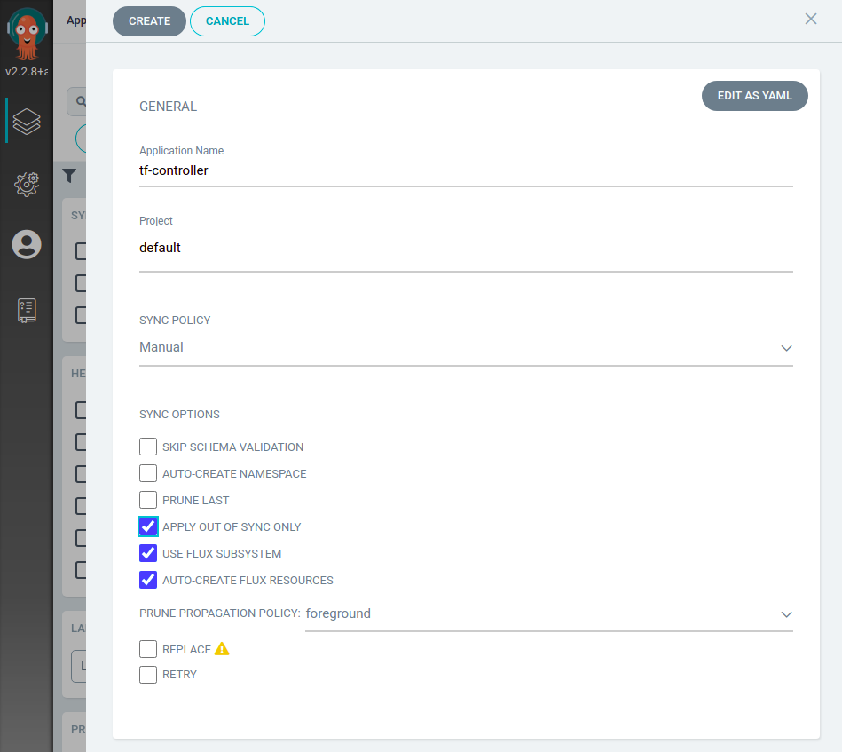
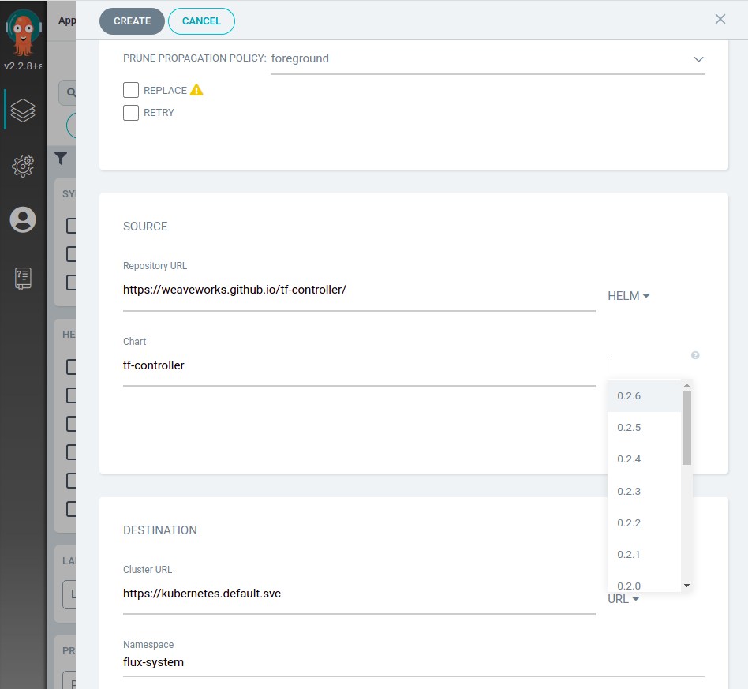
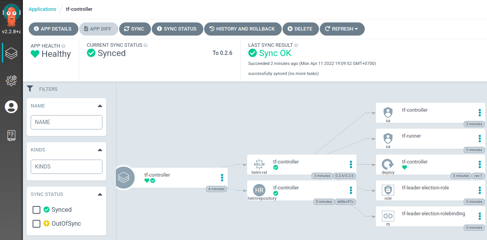
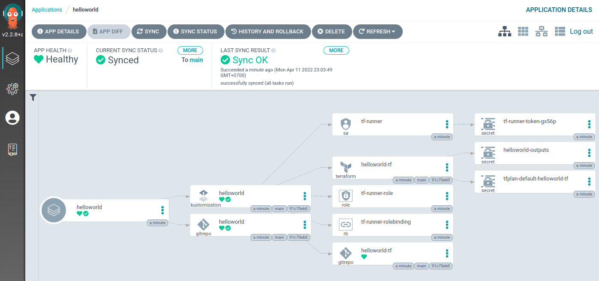

# GitOps Terraform Resources with Argo CD and Flux Subsystem for Argo

> ⏲️ Estimated time use: *12 minutes*.

This is a tutorial to show how could we use **Flux Subsystem for Argo** (FSA) to bring the Terraform management feature from **the Flux world** to your **Argo CD** UI. In order to do so, we need [Weave GitOps Terraform Controller](https://github.com/weaveworks/tf-controller) to help us reconcile our Terraform resources.

## What is Weave GitOps Terraform Controller?

**Weave GitOps Terraform Controller** aka **Weave TF-controller** is a Kubernetes controller that allows us to GitOpsify Terraform resources without rewriting them to YAML files. We can use Weave TF-controller in any GitOps environment managed by Flux or Argo CD. In this tutorial, we use FSA to bring Weave TF-controller to Argo CD.

## Tools used in this tutorial

We use the following tools in this tutorial.

  * A Kubernetes cluster. EKS on AWS, or `kind` on your desktop.
  * Argo CD **v2.2.12**
  * Flux v2 **0.32.0**
  * Flux Subsystem for Argo **FL.2**
  * Weave GitOps Terraform Controller **v0.11.0 or later**
  * `kubectl`
  * `kustomize`
  * `yq` (optional)

## Create a new KIND cluster

If you already have a `kind` cluster you can skip this step.
Also, if you'd like to use Kubernetes on a cloud like EKS on AWS, you can skip this step as well.

To create a new `kind` cluster, please install `kind` CLI and run the following command.

```shell
kind create cluster
```

## Install Argo CD

We use the official Argo CD instructions to install Argo CD. If you already have Argo CD v2.2.8 installed, you can skip this step. 
The installation here is the non-HA one. Please refer to the Argo CD documentation for the HA installation which is not covered by this tutorial.

> ⭐⭐ You can also skip this step if you choose to install Flux Subsystem for Argo from scratch (see: **Option 3**) ⭐⭐

```shell
kubectl create namespace argocd
kubectl apply -n argocd -f https://raw.githubusercontent.com/argoproj/argo-cd/v2.2.12/manifests/install.yaml
```

## Install Flux Subsystem for Argo

At your terminal, please set `FSA_VERSION` variable to a specific version of Flux Subsystem for Argo you'd like to install. In this tutorial, we use `v2.2.12-fl.2-main-a5a71f34`.

```shell
export FSA_VERSION=v2.2.12-fl.2-main-a5a71f34
```

There are many options to install **Flux Subsystem for Argo**. Please choose **one of the followings** to upgrade your existing Argo CD to FSA, replace the current Argo CD instalation with FSA, or install FSA from scratch.

### Option 1 - Upgrade the existing Argo CD

This option is to upgrade your existing Argo CD.  If you already have Argo CD installed, you would want to go with replacing the image of the existing instllation with the image from FSA.

```shell
kustomize build https://github.com/flux-subsystem-argo/flamingo//release?ref=${FSA_VERSION} \
  | yq e '. | select(.kind=="Deployment" or .kind=="StatefulSet")' - \
  | kubectl -n argocd apply -f - 
```

### Option 2 - Replace the current Argo CD

This option will replace your current installation, including every setting in your configmaps.

```shell
kubectl -n argocd apply -k https://github.com/flux-subsystem-argo/flamingo//release?ref=${FSA_VERSION}
```

### Option 3 - Install FSA from Scratch

With this option, you don't need any existing Argo CD installation.

```shell
kubectl create ns argocd
kubectl -n argocd apply -k https://github.com/flux-subsystem-argo/flamingo//release?ref=${FSA_VERSION}
```

### Install Flux

After installing FSA, now we install Flux into the cluster, simply by running the following commands.

```shell
brew install fluxcd/tap/flux
flux install
```

### Login to Argo CD UI

For a fresh Argo CD or FSA installation, you would find your initial admin password by running this command.

```shell
kubectl -n argocd get secret argocd-initial-admin-secret -o jsonpath="{.data.password}" | base64 -d; echo
```

Then please forward Argo CD UI's port to localhost:8080, open it with your Web browser and login with `admin` and your password found by the previous command.

```shell
kubectl -n argocd port-forward svc/argocd-server 8080:443
```

## Install Weave GitOps Terraform Controller

**Weave GitOps Terraform Controller** can be installed using its Helm chart. Now we have Flux Subsystem for Argo installed, we'll install a Helm chart via FSA.

> ⭐⭐ What is the difference between installation of a Helm chart with Argo CD and with FSA?
> Argo CD uses `helm template` then `kubectl apply` to install Helm charts. With this incomplete Helm support, 
> sometime Helm chart installations are broken.
> FSA, on the other hand, installs Helm charts via the official Helm SDK built into the Flux's Helm controller, 
> which provides the more robust Helm support. ⭐⭐

With FSA, your Argo CD UI will have 2 additional check boxes, ☑️ **Use Flux Subsystem**, and ☑️ **Auto-Create Flux Resources**. To make FSA work correctly, ☑️ **Apply Out Of Sync Only** is also required.



FSA does not change the way you work with Argo CD UI, just fill the Repository URL with `https://weaveworks.github.io/tf-controller`, specify the chart name `tf-controller` and choose the chart version which is `0.2.6`.



Let's review values we need here.

  * Application Name: **tf-controller**
  * Project: **default**
  * Sync Policy: **Manual**
  * Sync Options: 
  	- ☑️ **Apply Out Of Sync Only**
  	- ☑️ **Use Flux Subsystem**
  	- ☑️ **Auto-Create Flux Resources**
  * Repository URL: **https://weaveworks.github.io/tf-controller**
  * Chart: **tf-controller**
  * Cluster URL: **https://kubernetes.default.svc**
  * Namespace: **flux-system**

After review, please make sure that you check all 3 check boxes before click the "Create" button, and you are good to go.



## Connect to a Terraform GitOps repo

Now Weave TF-controller is installed and ready to use for GitOpsifying our Terraform resources.

To make it easy for everyone, we'll use a simple hello world Terraform file, which does not require any credentials, in this tutorial. This hello world Terraform is in the Git repository, which already contains everything. What you need to do is to fork the provided repository, create a new Flux Subsystem App in Argo CD, and done.

Let's start.

  * Fork `https://github.com/flux-subsystem-argo/tf-controller-helloworld` to your GitHub account.
  * Edit `./infra/setup.yaml`, change the URL to your repository.

Now it's time to create an App to manage our Terraform resource with Flux Subsystem for Argo.
Please use the following configuration for the new App (`helloworld`)

  * Application Name: **helloworld**
  * Project: **default**
  * Sync Policy: **Manual**
  * Sync Options: 
  	- ☑️ **Auto-Create Namespace**
  	- ☑️ **Apply Out Of Sync Only**
  	- ☑️ **Use Flux Subsystem**
  	- ☑️ **Auto-Create Flux Resources**
  * Repository URL: **https://github.com/YOUR-GITHUB-ACCOUNT/tf-controller-helloworld**
  * Revision: **main**
  * Path: **./infra**
  * Cluster URL: **https://kubernetes.default.svc**
  * Namespace: **dev**
 
After create the App, press Sync button once and wait. You could also press Refresh to see if the graph already there.
If everything is correct, you would get something like the following screenshot, with a nice Terraform icon!!



What did this `main.tf` do? This Terraform file did not provision anything, expect an output, 
which you might see that it was written into a Secret named `helloworld-outputs`, also shown in the graph.

What's inside that output secrets, here's the command to help you find out.

```shell
kubectl -n dev get secret helloworld-outputs -o jsonpath="{.data.hello_world}" | base64 -d; echo
```

## Summary

**Flux Subsystem for Argo** brings Terrform to your Argo CD UI. Not only TF-controller, you can virtually use any Flux features
side-by-side with your Argo CD.

What's next? You can now try provisioning your own Terraform resources by tweaking the `main.tf` file. Commit and push to see the change.
Flux Subsystem for Argo is currently a Technology Preview. Feedback really welcome to help improve it. This project aims at simplifying anyone DevOps journey, improving DevOps pipelines by the best GitOps technologies available.
